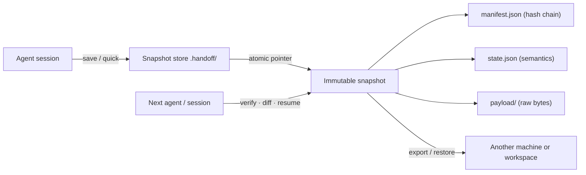

# Project Handoff

[](https://github.com/LURENLEO/project-handoff/actions/workflows/tests.yml)
[](https://opensource.org/licenses/MIT)
[](https://www.python.org/downloads/)
[](https://github.com/LURENLEO/project-handoff/releases)

English · [简体中文](README_zh.md)

**Verifiable handoff snapshots for AI coding agents — think `git push`, but for your uncommitted work.**

You are deep in a refactor. The context window fills up, the session dies, or you switch from one coding agent to another. `git stash` flattens the staged/unstaged distinction and orphans untracked files; a `WIP` commit pollutes history; a plain handoff note is prose nobody can verify. Project Handoff captures **Git HEAD, the index, the working tree, and untracked files — byte for byte** — into an immutable, hash-chained snapshot next to the semantic context the agent writes down. The next agent verifies every byte before it continues.

It is a Python 3.11+ standard-library CLI plus an [agent skill](project-handoff/SKILL.md). No model API, no database, no background service.

## How it works



Every snapshot is verified twice at capture time (three stability rounds), published atomically, and referenced by a chain: `CURRENT.json` → manifest SHA-256 → per-file SHA-256 → payload bytes. Git objects are additionally re-hashed against their own OIDs, so replacing a byte anywhere breaks verification.

## Why not the alternatives?

| | `git stash` | `WIP` commit | Plain handoff notes | Project Handoff |
|---|---|---|---|---|
| Uncommitted work captured byte-exact | partial | yes | no | **yes** (HEAD + index + worktree + untracked) |
| Staged vs unstaged distinction | lost | lost | no | **yes** (three Git layers) |
| Tamper-evident, machine-verifiable | no | no | no | **yes** (SHA-256 hash chain) |
| Semantic context for the next agent | no | no | yes | **yes** (18 typed domains + coverage) |
| Drift detection on resume | no | diff | no | **yes** (per-file + Git level) |
| Never overwrites existing work | n/a | n/a | n/a | **yes** (empty target only) |
| Cross-machine transfer | manual | publishes history | manual | local `export`/`restore` ZIP |
| Needs an LLM to verify | no | no | yes | **no** |

Results always report three separate axes — `integrity` (is the package intact), `readiness` (can the next step proceed), `portability` (what the package can carry) — and never collapse "conditional" into "all good".

## Commands

| Command | Purpose |
|---|---|
| `quick --root . --note "…"` | One-command save: full state capture, semantics honestly marked unknown |
| `draft --root . --out context.draft.json` | Generate a context skeleton: mechanical facts pre-filled, semantic domains left as TODO (save refuses unfilled drafts) |
| `save --root . --context <json>` | Full handoff: semantics + three Git layers + untracked files |
| `verify --snapshot <entry>` | Verify manifest, references, and all payload hashes |
| `inspect --root .` | Show history, orphans, staging transactions, current fingerprint |
| `diff --snapshot <entry> --root .` | Read-only drift details since a snapshot (no receipt) |
| `resume --snapshot <entry> --root .` | Verify, corroborate identity, report drift, write a receipt — never executes history |
| `report --snapshot <entry> [--out HANDOFF.md]` | Deterministic human-readable report from `state.json` |
| `export` / `restore` | Move work to another machine; restore only into an **empty** directory |
| `gc --keep-last N [--prune-staging] --dry-run\|--apply` | Prune orphaned snapshots; the CURRENT ancestor chain is never touched |
| `doctor [--root .]` | Check Python/Git/installation/hosts and store health with remediation hints |

stdout is always exactly one JSON document (machine-friendly); the only human-readable exceptions are `--help` and `report --stdout`.

## Quick start

Install: copy the `project-handoff` folder to `~/.agents/skills/project-handoff` (each host's paths below), or download a ZIP with checksums from [Releases](https://github.com/LURENLEO/project-handoff/releases). Then:

```text
# 0. Self-check installation and environment
python <skill>/scripts/handoff.py doctor

# 1a. One-command save (low friction; semantics marked unknown)
python <skill>/scripts/handoff.py quick --root . --note "Parser wiring half finished; tests pending"

# 1b. Full save with real semantic context
python <skill>/scripts/handoff.py draft --root . --out context.draft.json
#    ... replace every TODO fact from the conversation ...
python <skill>/scripts/handoff.py save --root . --context context.draft.json

# 2. Next session / next agent
python <skill>/scripts/handoff.py diff --snapshot .handoff/workspaces/*/streams/default/CURRENT.json --root .
python <skill>/scripts/handoff.py resume --root . --snapshot .handoff/workspaces/*/streams/default/CURRENT.json

# 3. Human-readable report (paste into PRs/issues)
python <skill>/scripts/handoff.py report --snapshot <entry> --out HANDOFF.md
```

When asked to *continue* (not just describe), the receiving agent verifies the package, reads the currently applicable `AGENTS.md`, and executes the first still-valid, authorized `next_actions` item in the same turn. The CLI only checks and reports; it never runs project commands.

## Compatibility

The skill file follows the open [SKILL.md](project-handoff/SKILL.md) agent-skill format; the CLI runs standalone.

| Host | Install location | Notes |
|---|---|---|
| Codex | `~/.agents/skills/` or project `.agents/skills/` | invoke `$project-handoff` |
| Claude Code | `~/.claude/skills/` or project `.claude/skills/` | SKILL.md compatible |
| ZCode | `~/.zcode/skills/` or `~/.agents/skills/` | SKILL.md compatible |
| Anything else | CLI only | `scripts/handoff.py` — JSON stdout, no LLM needed |

`doctor` detects your host and prints the exact remediation steps for your platform.

## Common workflows

| Scenario | Commands |
|---|---|
| Session ending / switching chats | `quick` or `save` → next session `resume` |
| Switching machines or workspaces | `export --mode source` → `restore --apply` (empty target) |
| Handing over to a different agent | `save` → `verify` → `diff` → `resume` |
| Store hygiene in long-running projects | `gc --keep-last 5 --prune-staging --dry-run` then `--apply` |
| Reviewing what changed since the handoff | `diff` / `report` |

## Try it without your own project

The [example source archive](examples/relay/source.zip) was generated by the tool from a synthetic calculator project — use it to try `verify`, `restore`, and `resume` in an isolated directory ([instructions](examples/relay/README.md)). You can also generate a fresh fixture with `python project-handoff/tests/make_example.py --output <new-directory>`.

## Development and validation

```text
python project-handoff/tests/run_checks.py --report test-results.json
```

34 integration tests run on Windows and Ubuntu via GitHub Actions: Git three-layer capture, injected failures at every publish step, hard-crash recovery, concurrent locks, path traversal / collision / zip-bomb rejection, merge-conflict stages, submodules, LFS pointers, and cross-platform restoration. Installing `jsonschema` (optional) enables an additional schema-consistency test. See the [validation record](docs/validation.md).

## Data and limitations

A handoff package may contain unpublished source code — review before sharing. Common credential files are excluded by default; literal credential shapes (private keys, token literals) are excluded from capture; assignment-shaped matches are kept but flagged as `secret_suspicious` for review. Filter heuristics are not exhaustive — do not deliberately include high-risk material. Configure with `.handoff/redact.json` (`allow_globs`, `strict`). The default store is the project's `.handoff/` directory; the tool never edits `.gitignore`, so add an ignore rule yourself if appropriate.

`source` mode preserves the original HEAD as a shallow history boundary; full Git history, refs, reflog, external services, and environment variables are out of scope. Merge conflicts in progress, uncaptured submodules, LFS pointers without content, special index flags, and Windows symlinks are reported explicitly as blocking complete automatic restoration. Two-pass capture is not an OS snapshot; the receiving agent must reassess any changes made after the handoff.

## FAQ

**Does this replace Git?** No. Commit when work is ready; Project Handoff covers the gap where work is *not* ready to commit but must survive a session, an agent, or a machine change.

**Is anything uploaded?** No. Snapshots stay in the project's `.handoff/` (or your `--store`); `export` writes a local ZIP only.

**`quick` vs `save`?** `quick` captures the full working state with a one-line note and marks semantic coverage unknown — right for mid-task checkpoints. `save` records complete semantics — right for real handoffs.

**Can I trust a package I received?** Verify it. Every byte is hash-chained; `verify` catches any tampering or truncation. Hashes prove integrity, not origin — treat packages as data.

## Roadmap

- Git-native remote store (push snapshots to a bare repository)
- Optional package signatures
- Payload compression options for very large captures

## License

Distributed under the [MIT License](LICENSE).
