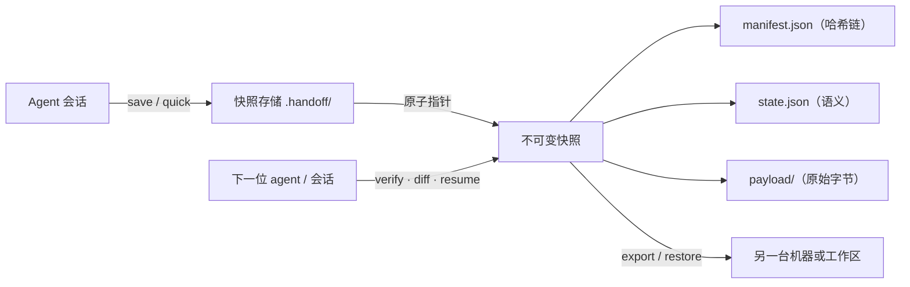

# Project Handoff

[](https://github.com/LURENLEO/project-handoff/actions/workflows/tests.yml)
[](https://opensource.org/licenses/MIT)
[](https://www.python.org/downloads/)
[](https://github.com/LURENLEO/project-handoff/releases)

[English](README.md) · 简体中文

**给 AI 编程 agent 的可验证交接快照——相当于为"未提交的工作"做的 git push。**

你正在重构进行中：上下文窗口满了、会话中断了、或者要从一个编程 agent 换到另一个。`git stash` 抹平暂存/未暂存的区别、未跟踪文件各自飘散；`WIP` 提交污染历史；普通交接笔记只是谁也无法核验的散文。Project Handoff 把 **Git HEAD、暂存区、工作树和未跟踪文件逐字节**采集进不可变的哈希链快照，与 agent 写下的语义上下文并存。下一位 agent 先核验每一个字节，再继续工作。

它是一个 Python 3.11+ 标准库 CLI 加一个 [agent skill](project-handoff/SKILL.md)。不需要模型 API、数据库或常驻服务。

## 工作原理



每次采集做双次校验（最多三轮稳定性检查）、原子发布，并用链式哈希引用：`CURRENT.json` → manifest SHA-256 → 逐文件 SHA-256 → payload 字节。Git 对象还会按自身 OID 独立重哈希——替换任何位置的任何一个字节都会让核验失败。

## 为什么不用现有方案？

| | `git stash` | `WIP` 提交 | 普通交接笔记 | Project Handoff |
|---|---|---|---|---|
| 未提交工作逐字节捕获 | 部分 | 是 | 否 | **是**（HEAD + 暂存区 + 工作树 + 未跟踪） |
| 暂存/未暂存区别 | 丢失 | 丢失 | 否 | **是**（三层 Git 状态） |
| 防篡改、机器可核验 | 否 | 否 | 否 | **是**（SHA-256 哈希链） |
| 给下一位 agent 的语义上下文 | 否 | 否 | 是 | **是**（18 个结构化域 + coverage） |
| 接手时的漂移检测 | 否 | diff | 否 | **是**（逐文件 + Git 层） |
| 绝不覆盖现有工作 | 不适用 | 不适用 | 不适用 | **是**（只允许空目录） |
| 跨机器迁移 | 手动 | 泄露历史 | 手动 | 本地 `export`/`restore` ZIP |
| 核验需要 LLM | 否 | 否 | 是 | **否** |

结果始终单独报告三个维度——`integrity`（包是否完整）、`readiness`（下一步能否进行）、`portability`（包能携带什么）——绝不把 "conditional" 说成"一切就绪"。

## 命令一览

| 命令 | 用途 |
|---|---|
| `quick --root . --note "…"` | 一条命令保存：完整状态采集，语义如实标记 unknown |
| `draft --root . --out context.draft.json` | 生成 context 骨架：机械事实预填，语义域留 TODO（未填写的草稿会被 save 拒绝） |
| `save --root . --context <json>` | 完整交接：语义 + 三层 Git 状态 + 未跟踪文件 |
| `verify --snapshot <入口>` | 核验 manifest、引用与全部载荷哈希 |
| `inspect --root .` | 查看历史、孤立快照、未发布事务、当前代码指纹 |
| `diff --snapshot <入口> --root .` | 只读输出快照以来的漂移明细（不写 receipt） |
| `resume --snapshot <入口> --root .` | 核验、佐证身份、报告漂移、写 receipt——绝不执行历史命令 |
| `report --snapshot <入口> [--out HANDOFF.md]` | 由 `state.json` 确定性渲染人可读报告 |
| `export` / `restore` | 跨机器迁移；恢复只允许进入**空目录** |
| `gc --keep-last N [--prune-staging] --dry-run\|--apply` | 清理孤立快照；CURRENT 祖先链永不触碰 |
| `doctor [--root .]` | 自检 Python/Git/安装位置/宿主与存储健康，并给出修复建议 |

stdout 恒为单个 JSON 文档（面向自动化）；仅 `--help` 与 `report --stdout` 是人类可读例外。

## 快速开始

安装：把 `project-handoff` 文件夹复制到 `~/.agents/skills/project-handoff`（各宿主路径见下），或从 [Releases](https://github.com/LURENLEO/project-handoff/releases) 下载带校验和的 ZIP。然后：

```text
# 0. 自检安装与环境
python <skill>/scripts/handoff.py doctor

# 1a. 一条命令保存（低摩擦；语义标记 unknown）
python <skill>/scripts/handoff.py quick --root . --note "解析器接了一半；测试未跑"

# 1b. 带真实语义上下文的完整保存
python <skill>/scripts/handoff.py draft --root . --out context.draft.json
#    ……从对话中补齐每个 TODO 事实……
python <skill>/scripts/handoff.py save --root . --context context.draft.json

# 2. 下一个会话 / 下一位 agent
python <skill>/scripts/handoff.py diff --snapshot .handoff/workspaces/*/streams/default/CURRENT.json --root .
python <skill>/scripts/handoff.py resume --root . --snapshot .handoff/workspaces/*/streams/default/CURRENT.json

# 3. 人可读报告（可贴进 PR/issue）
python <skill>/scripts/handoff.py report --snapshot <入口> --out HANDOFF.md
```

当用户要求**继续**（而不只是介绍）时，接手的 agent 会核验包、读取当前适用的 AGENTS.md，并在同一轮执行第一项仍有效、已授权的 `next_actions`。CLI 只检查和报告，绝不运行项目命令。

## 兼容性

skill 文件遵循开放的 [SKILL.md](project-handoff/SKILL.md) agent-skill 格式；CLI 可独立运行。

| 宿主 | 安装位置 | 说明 |
|---|---|---|
| Codex | `~/.agents/skills/` 或项目 `.agents/skills/` | 调用 `$project-handoff` |
| Claude Code | `~/.claude/skills/` 或项目 `.claude/skills/` | SKILL.md 兼容 |
| ZCode | `~/.zcode/skills/` 或 `~/.agents/skills/` | SKILL.md 兼容 |
| 其他任意 agent | 仅 CLI | `scripts/handoff.py` —— JSON stdout，无需 LLM |

`doctor` 会探测你的宿主并给出对应平台的修复步骤。

## 常用工作流

| 场景 | 命令 |
|---|---|
| 会话结束 / 切换对话 | `quick` 或 `save` → 下个会话 `resume` |
| 换机器或换工作区 | `export --mode source` → `restore --apply`（空目标） |
| 交接给另一位 agent | `save` → `verify` → `diff` → `resume` |
| 长期项目的存储清理 | `gc --keep-last 5 --prune-staging --dry-run` 后 `--apply` |
| 回顾交接之后改了什么 | `diff` / `report` |

## 不用自己项目也能试

[示例源码包](examples/relay/source.zip)由工具从一个合成的计算器项目生成——可在隔离目录里试用 `verify`、`restore`、`resume`（[说明](examples/relay/README.md)）。也可以用 `python project-handoff/tests/make_example.py --output <新目录>` 生成全新样例。

## 开发与验证

```text
python project-handoff/tests/run_checks.py --report test-results.json
```

34 个集成测试经 GitHub Actions 在 Windows 与 Ubuntu 上运行：Git 三层采集、每个发布步骤的故障注入、硬崩溃恢复、并发锁、路径穿越/碰撞/zip 炸弹拒绝、合并冲突 stage、子模块、LFS 指针、跨平台恢复。可选安装 `jsonschema` 启用额外的 schema 一致性测试。见[验证记录](docs/validation.md)。

## 数据与边界

交接包可能包含未发布的源码——分享前先审阅。常见凭据文件默认排除；字面凭据形状（私钥块、token 字面量）从采集中排除；仅键名形状的命中保留字节并标记 `secret_suspicious` 待审。启发式过滤不是穷尽检测——不要故意纳入高风险材料。可用 `.handoff/redact.json` 配置（`allow_globs`、`strict`）。默认存储是项目的 `.handoff/` 目录；工具不会改 `.gitignore`，需要时请自行添加忽略规则。

`source` 模式保留原始 HEAD 作为浅历史边界；完整 Git 历史、refs、reflog、外部服务与环境变量不在范围内。进行中的合并冲突、未递归子模块、无实际内容的 LFS 指针、特殊 index 标志和 Windows 符号链接都会被明确报告为阻断完整自动恢复。双次采集不是操作系统快照；接手 agent 必须重新评估交接之后发生的更改。

## FAQ

**它能替代 Git 吗？** 不能。工作就绪时请正常提交；Project Handoff 覆盖的是"还没准备好提交、但必须跨会话/跨 agent/跨机器存活"的空档。

**会上传任何东西吗？** 不会。快照保存在项目的 `.handoff/`（或你的 `--store`）；`export` 只写本地 ZIP。

**`quick` 和 `save` 怎么选？** `quick` 用一句话捕获完整工作状态、语义标记 unknown——适合任务中途存档。`save` 记录完整语义——适合正式交接。

**收到别人的交接包能信吗？** 核验它。每个字节都在哈希链上；`verify` 能发现任何篡改或截断。哈希证明完整性，不证明来源——把包当数据处理。

## 路线图

- Git 原生远端存储（把快照 push 到 bare 仓库）
- 可选的包签名
- 大体积采集的载荷压缩选项

## 许可证

基于 [MIT License](LICENSE) 分发。
